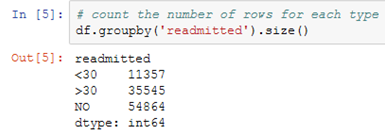
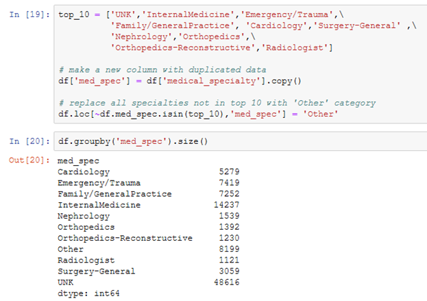
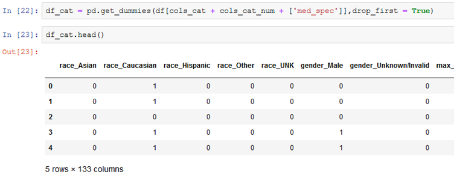
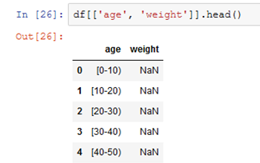
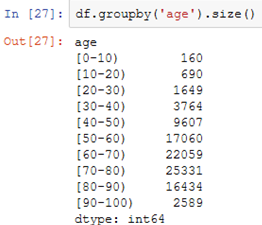
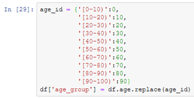
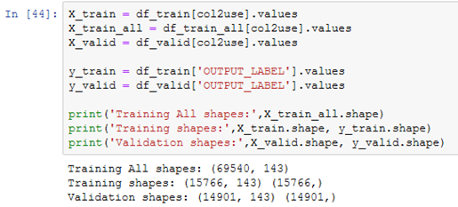
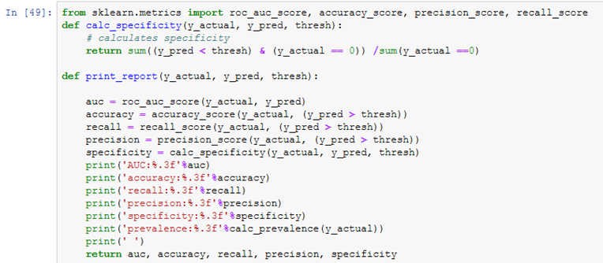
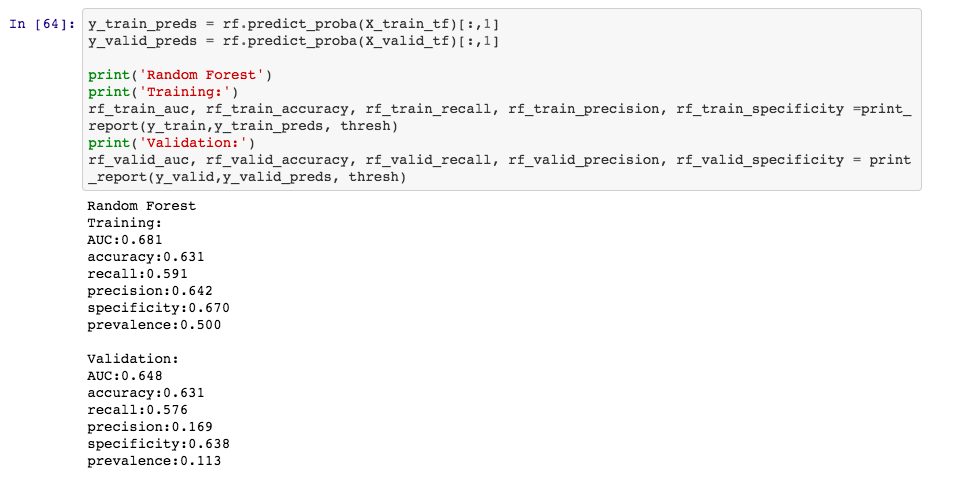

# Predict Hospital Readmission for Patients with Diabetes

## Problem
Diabetes is a condition in which there is too much glucose (a type of sugar) in the blood. Over time, high blood glucose levels can damage the body's organs. Possible complications include damage to large (macrovascular) and small (microvascular) blood vessels, which can lead to heart attack, stroke, and problems with the kidneys, eyes, gums, feet and nerves. 

## Facts Exploration
Risk of most diabetes-related complications can be reduced by keeping blood pressure, blood glucose and cholesterol levels within recommended range. Also, being a healthy weight, eating healthily, reducing alcohol intake, and not smoking will help reduce your risk. Regular check-ups and screening are important to pick up any problems early.

As the healthcare system moves toward value-based care, CMS has created many programs to improve the quality of care of patients. One of these programs is called the Hospital Readmission Reduction Program ([HRRP](https://www.cms.gov/Medicare/Quality-Initiatives-Patient-Assessment-Instruments/Value-Based-Programs/HRRP/Hospital-Readmission-Reduction-Program.html)), which reduces reimbursement to hospitals with above average readmissions. For those hospitals which are currently penalized under this program, one solution is to create interventions to provide additional assistance to patients with increased risk of readmission. But how do we identify these patients? We can use predictive modeling from data science to help prioritize patients.

One patient population that is at increased risk of hospitalization and readmission is that of diabetes. Diabetes is a medical condition that affects approximately 1 in 10 patients in the United States. According to Ostling et al, patients with diabetes have almost double the chance of being hospitalized than the general population ([Ostling et al 2017](https://clindiabetesendo.biomedcentral.com/articles/10.1186/s40842-016-0040-x)). Therefore, in this article, I will focus on predicting hospital readmission for patients with diabetes. In this usecase we will explore how to build a model predicting readmission in Python.

## How-To
Predict if a patient with diabetes will be readmitted to the hospital within 30 days.


## Data Sources:
The data that is used in this project originally comes from the UCI machine learning repository. The data consists of over 100000 hospital admissions from patients with diabetes from 130 US hospitals between 1999–2008.


## Data Modeling:
In this project, we will utilize Python to build the predictive model. Let’s begin by loading the data and exploring some of the columns. We can start using `scikit-learn` python machine learning library combined with `python-pandas` library for data wranging.

`In [1]:`
```python
import pandas as pd
import numpy as np
import matplotlib.pyplot as plt
import time

# load the csv file
df = pd.read_csv('diabetic_data.csv')

print('Number of samples:',len(df))
```
__Output:__ Number of samples: 101766


From briefly, looking through the data columns, we can see there are some identification columns, some numerical columns, and some categorical (free-text) columns. These columns will be described in more detail below.


There is some missing data that are represented with a question mark (?). We will deal with this in the feature engineering section.

The most important column here is readmitted, which tells us if a patient was hospitalized within 30 days, greater than 30 days or not readmitted.



Another column that is important is `discharge_disposition_id`, which tells us where the patient went after the hospitalization. If we look at the IDs_mapping.csv provided by UCI we can see that 11,13,14,19,20,21 are related to death or hospice. We should remove these samples from the predictive model since they cannot be readmitted.

`In [6]:`
```python
df = df.loc[~df.discharge_disposition_id.isin([11,13,14,19,20,21])]
```

Now let’s define an output variable for our binary classification. Here we will try to predict if a patient is likely to be re-admitted within 30 days of discharge.

`In [7]:`
```python
df['OUTPUT_LABEL'] = (df.readmitted == '<30').astype('int')
```

Let’s define a function to calculate the prevalence of population that is readmitted with 30 days.


Around 11% of the population is rehospitalized. This represented an imbalanced classification problem so we will address that below.

From further analysis of the columns, we can see there are a mix of categorical (non-numeric) and numerical data. A few things to point out,

-   `encounter_id` and `patient_nbr`: these are just identifiers and not useful variables
  
-   `age` and `weight`: are categorical in this data set
-   `admission_type_id`,`discharge_disposition_id`,`admission_source_id`: are numerical here, but are IDs (see IDs_mapping). They should be considered categorical.
-   `examide` and `citoglipton` only have 1 value, so we will not use these variables
`diag1`, `diag2`, `diag3` — are categorical and have a lot of values. We will not use these as part of this project, but you could group these ICD codes to reduce the dimension. We will use number_diagnoses to capture some of this information.
-   `medical_speciality` — has many categorical variables, so we should consider this when making features.


Now we are in need of creating new features to make the model more reliable, We can create new features from existing context of the dataset using Feature Engineering.

## Feature Engineering
In this section, we will create features for our predictive model. For each section, we will add new variables to the dataframe and then keep track of which columns of the dataframe we want to use as part of the predictive model features. We will break down this section into numerical features, categorical features and extra features.

In this data set, the missing numbers were filled with a question mark. Let’s replace it with a nan representation.

`In [10]:`
```python
# replace ? with nan
df = df.replace('?',np.nan)
```

### Numerical Features
The easiest type of features to use is numerical features. These features do not need any modification. The columns that are numerical that we will use are shown below

```python
cols_num = ['time_in_hospital','num_lab_procedures', 'num_procedures', 'num_medications',
       'number_outpatient', 'number_emergency', 'number_inpatient','number_diagnoses']
```

Let’s check if there are any missing values in the numerical data.

`In [12]: `
```python
df[cols_num].isnull().sum()
```
`Out[12]:`
```python
time_in_hospital      0
num_lab_procedures    0
num_procedures        0
num_medications       0
number_outpatient     0
number_emergency      0
number_inpatient      0
number_diagnoses      0
dtype: int64
```

### Categorical Features
The next type of features we want to create are categorical variables. Categorical variables are non-numeric data such as race and gender. To turn these non-numerical data into variables, the simplest thing is to use a technique called one-hot encoding, which will be explained below.

The first set of categorical data we will deal with are these columns:

`In [14]:`
```python
cols_cat = ['race', 'gender', 
       'max_glu_serum', 'A1Cresult',
       'metformin', 'repaglinide', 'nateglinide', 'chlorpropamide',
       'glimepiride', 'acetohexamide', 'glipizide', 'glyburide', 'tolbutamide',
       'pioglitazone', 'rosiglitazone', 'acarbose', 'miglitol', 'troglitazone',
       'tolazamide', 'insulin',
       'glyburide-metformin', 'glipizide-metformin',
       'glimepiride-pioglitazone', 'metformin-rosiglitazone',
       'metformin-pioglitazone', 'change', 'diabetesMed','payer_code']
```
Of our categorical features, `race`, `payer_code`, and `medical_specialty` have missing data. Since these are categorical data, the best thing to do is to just add another categorical type for unknown using the `fillna` function.

`In [15]:`
```python
df['race'] = df['race'].fillna('UNK')
df['payer_code'] = df['payer_code'].fillna('UNK')
df['medical_specialty'] = df['medical_specialty'].fillna('UNK')
```

Note that `medical_specialty` is not contained in our list above because we need to do one more processing step. Let’s investigate medical specialty before we begin with one-hot encoding.

`In [16]:`
```python
print('Number medical specialty:', df.medical_specialty.nunique())
df.groupby('medical_specialty').size().sort_values(ascending = False)
```
Number medical specialty: 73

`Out[16]:`
```python
medical_specialty
UNK                                  48616
InternalMedicine                     14237
Emergency/Trauma                      7419
Family/GeneralPractice                7252
Cardiology                            5279
Surgery-General                       3059
Nephrology                            1539
Orthopedics                           1392
Orthopedics-Reconstructive            1230
Radiologist                           1121
Pulmonology                            854
Psychiatry                             853
Urology                                682
ObstetricsandGynecology                669
Surgery-Cardiovascular/Thoracic        642
Gastroenterology                       538
Surgery-Vascular                       525
Surgery-Neuro                          462
PhysicalMedicineandRehabilitation      391
Oncology                               319
Pediatrics                             253
Neurology                              201
```

We can see that most of them are unknown and that the count drops off pretty quickly. We don’t want to add 73 new variables since some of them only have a few samples. As an alternative, we can create a new variable that only has 11 options (the top 10 specialities and then an other category). Obviously, there are other options for bucketing, but this is one of the easiest methods for reducing the number of possible categories.



To convert our categorical features to numbers, we will use a technique called one-hot encoding. In one-hot encoding, you create a new column for each unique value in that column. Then the value of the column is 1 if the sample has that unique value or 0 otherwise. For example, for the column race, we would create new columns `(‘race_Caucasian’,’race_AfricanAmerican’, etc)`. If the patient’s race is Caucasian, the patient gets a 1 under ‘race_Caucasian’ and 0 under the rest of the race columns. To create these one-hot encoding columns, we can use the `get_dummies` function provided by pandas

Now the problem is that if we create a column for each unique value, we have correlated columns. In other words, the value in one column can be figured out by looking at the rest of the columns. For example, if the sample is not African, American, Asian, Causasian, Hispance or Other, it must be UNK. To deal with this, we can use the `drop_first` option, which will drop the first categorical value for each column.

The `get_dummies` function does not work on numerical data. To trick `get_dummies`, we can convert the numerical data from the 3 ID types into strings and then it will work properly.


Now we are ready to make all of our categorical features



To add the one-hot encoding columns to the dataframe we can use concat function. Make sure to use axis = 1 to indicate add the columns.


Let’s save the column names of the categorical data to keep track of them.


### Extra Features
The last two columns we want to make features are `age` and `weight`. Typically, you would think of these as numerical data, but they are categorical in this dataset as shown below.



One option could be to create categorical data as shown above. Since there is a natural order to these values, it might make more sense to convert these to numerical data that is ordered. Another example when you would want to do this might be size of a t-shirt `(small, medium, large)`. Let’s start with age.



Let’s map these to 0 to 90 by 10s for the numerical data.



Now let’s look at weight. Note that this feature is not filled out very often.


Instead of creating an ordinal feature that we did above, let’s just create a variable to say if weight was filled out or not. The presence of a variable might be predictive regardless of the value.


Let’s keep track of these extra columns too.


### Feature Engineering: Summary
Through this process we created 143 features for the machine learning model. The break-down of the features is

- 8 numerical features
- 133 categorical features
- 2 extra features

Let’s make a new dataframe that only has the features and the `OUTPUT_LABEL`.


### Building Training/Validation/Test Samples
So far we have explored our data and created features from the categorical data. It is now time for us to split our data. The idea behind splitting the data is so that you can measure how well your model would do on unseen data. We split into three parts:

- Training samples: these samples are used to train the model
-  Validation samples: these samples are held out from the training data and are used to make decisions on how to improve the model
- Test samples: these samples are held out from all decisions and are used to measure the generalized performance of the model
 
In this usecase, we will split into `70% train`, `15% validation`, and `15% test`.

The first thing I like to do is to shuffle the samples using sample in case there was some order (e.g. all positive samples on top). Here `n` is the number of samples. `random_state` is just specified so the usecase is reproducable. You wouldn't need `random_state` necessarily in your own usecase.


We can use sample again to extract 30% (using frac) of the data to be used for validation / test splits. It is important that validation and test come from similar distributions and this technique is one way to do it.


And now split into test and validation using 50% fraction.


Note that `.drop` just drops the rows from df_test to get the rows that were not part of the sample. We can use this same idea to get the training data.


At this point, let’s check what percent of our groups are hospitalized within 30 days. This is known as prevalence. Ideally, all three groups would have similar prevalance.


The prevalence is about the same for each group. At this point, you might say, drop the training data into a predictive model and see the outcome. However, if we do this, it is possible that we will get back a model that is 89% accurate. Great! Good job! But wait, we never catch any of the readmissions (recall= 0%). How can this happen?

What is happening is that we have an imbalanced dataset where there are much more negatives than positives, so the model might just assign all samples as negative.

Typically, it is better to balance the data in some way to give the positives more weight. There are 3 strategies that are typically utilized

- sub-sample the more dominant class: use a random subset of the negatives
- over-sample the imbalanced class: use the same positive samples multiple times
- create synthetic positive data

Usually, you will want to use the latter two methods if you only have a handful of positive cases. Since we have a few thousand positive cases, let’s use the sub-sample approach. Here, we will create a balanced training data set that has 50% positive and 50% negative. You can also play with this ratio to see if you can get an improvement.


Most machine learning packages like to use an input matrix X and output vector y, so let’s create those:



Some machine learning models have trouble when the variables are of different size (0–100, vs 0–1000000). To deal with that we can scale the data. Here we will use scikit-learn’s Standard Scaler which removes the mean and scales to unit variance. Here I will create a scaler using all the training data, but you could use the balanced one if you wanted.


We will need this scaler for the test data, so let’s save it using a package called `pickle`.


Now we can transform our data matrices


We won’t transform the test matrix yet, so we aren’t tempted to look at the performance until we are done with model selection.

### Model Selection
Wow! so much work to get ready for a model. This is always true in data science. You spend 80–90% cleaning and preparing data.

In this section, we train a few machine learning models and use a few techniques for optimizing them. We will then select the best model based on performance on the validation set.

We will utilize the following functions to evaluate the performance of the model. For a discussion of these performance metrics, see my prior articles



Since we balanced our training data, let’s set our threshold at 0.5 to label a predicted sample as positive.

```python
thresh = 0.5
```

### Random forest
Random Forest is a flexible, easy to use machine learning algorithm that produces, even without hyper-parameter tuning, a great result most of the time. It is also one of the most used algorithms, because it's simplicity and the fact that it can be used for both classification and regression tasks.

One disadvantage of decision trees is that they tend overfit very easily by memorizing the training data. As a result, random forests were created to reduce the overfitting. In random forest models, multiple trees are created and the results are aggregated. The trees in a forest are decorrelated by using a random set of samples and random number of features in each tree. In most cases, random forests work better than decision trees because they are able to generalize more easily. To fit random forests, we can use the following code.





## Outcome
Through this project, we created a binary classifier to predict the probability that a patient with diabetes would be readmitted to the hospital within 30 days. On held out test data, our best model had an AUC of of 0.681. Using this model, we are able to catch 58% of the readmissions from our model that performs approximately 1.5 times better than randomly selecting patients.

## Deployment 
We have reached the exact point in which the model which ever been built has to be deployed in-order to predict the readmission of diabetic patients. 

## Outcomes 

## Deployment 

## Conclusions

### Links:
- HRRP: https://www.cms.gov/Medicare/Quality-Initiatives-Patient-Assessment-Instruments/Value-Based-Programs/HRRP/Hospital-Readmission-Reduction-Program.html
- Ostling et al 2017: https://clindiabetesendo.biomedcentral.com/articles/10.1186/s40842-016-0040-x
- Dataset: https://archive.ics.uci.edu/ml/datasets/diabetes+130-us+hospitals+for+years+1999-2008